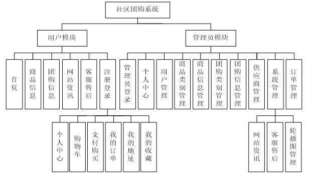

# 基于Springboot的社区团购系统

## Springboot-0012


## 技术栈

Springboot mybatisplus vue mysql maven


## 数据库表(14张)


## 功能介绍

```properties
1.团购管理：
对团购活动、商品、供应商等信息进行发布；
2.商品/团购搜索：
按分类对商品/团购进行筛选，可根据用户输入的关键字进行查询；
3.团购详情：
查看团购信息，点击商品显示商品详细介绍、价格、购买用户、用户评价等信息；
4.订单与支付管理：
提供买家与平台的订单管理功能，买家可追踪商品运输进度，平台可查询销售统计；为系统提供对接在线支付平台，提供在线支付服务；
5.社区管理：
对社区信息、配送员、社区业主等信息进行管理维护；
6.用户功能：
（1）进行注册登陆，修改个人信息等功能；
（2）用户可查看商品详情以及加入购物车，在购物车内结算，并提交订单支付，并对订单进行管理。
```


## 图片

### 前台


### 


### 后台


## 访问路径

### 前台

```properties
http://localhost:8080/springboot2c1hu/front/pages/login/login.html

账号 1
密码 1
```

### 后台

```properties
http://localhost:8080/springboot2c1hu/admin/dist/index.html#/login

账号 abo
密码 abo
```


## 功能图




## 文档目录


## 打赏或交流


